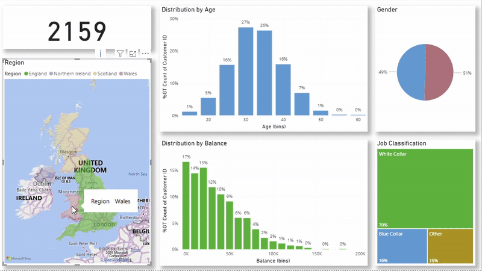

📊 Power BI Projects
Overview

Improving my Power BI skills, I did several projects to learn the tools and capabilities of Power BI

Techniques: Modeling, Joining, Maps, Dashboards

🖥️ Dashboard Preview

Here’s what the Banking dashboard looks like:

And Here is the Sales Map Dashboard:

📂 Repository Contents

BI Banking Report - A dashboard of sample banking data where you can explore age, gender, deposit amount and region

Euro Debt Chord Chart - Charts exploring the relationships between debtors and creditors in the Euro Debt Crisis

Sales Maps - interactive maps with sales data explorable by sales type and profitability

README.md – this file

🚀 Try It Yourself

Download and Open Locally:

Clone/download this repo.

Open the .pbix file in Power BI Desktop.

⚙️ Features & Skills Demonstrated

Data Modeling: Relationships between tables, star schema design

DAX Measures: Calculated columns, measures, KPIs

ETL: Data cleaning & transformation using Power Query

Visualization: Custom visuals, slicers, drill-through, bookmarks

Storytelling: Designed for readability & insights

🛠️ Tools Used

Power BI Desktop

📧 Contact

Created by Kaity Dixon - feel free to reach out!
